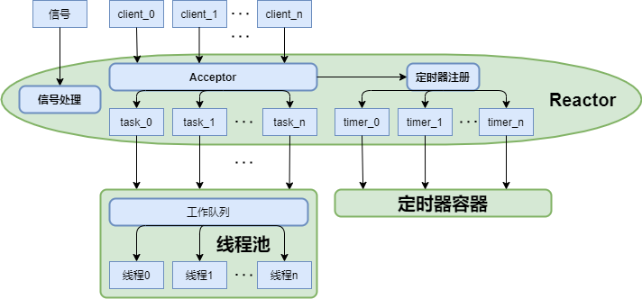
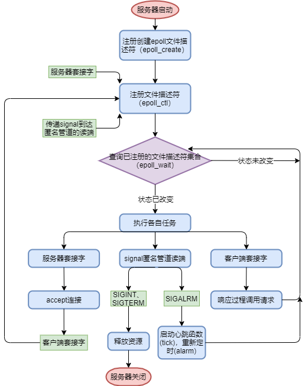
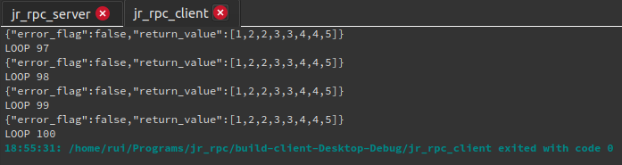

# jrRPC   
基于IO复用与单Reactor多线程模式，采用定时器管理连接的Linux操作系统json-RPC服务端与客户端框架。

## 1 文件结构
├── client	客户端    
│   ├── CMakeLists.txt   
│   ├── CMakeLists.txt.user   
│   ├── main.cpp	客户端使用示例   
│   └── src	客户端源文件   
│       └── rpc_client.hpp	  
└── server	服务端  
    ├── CMakeLists.txt   
    ├── CMakeLists.txt.user  
    ├── main.cpp	服务端使用示例   
    ├── registed_fun	预置的可调用过程   
    │   └── sort  
    │       └── sort.hpp  
    └── src	服务端源文件  
        ├── log.hpp	简单日志系统  
        ├── log.cpp  
        ├── rpc_server.hpp	服务端  
        ├── thread_pool.hpp	线程池  
        ├── thread_pool.cpp  
        ├── timer.hpp	定时器系统  
        └── timer.cpp    

## 2 使用方法
### 2.1 客户端

step1. include "rpc_client.hpp"；                        

step2. 初始化jrRPC::client对象，给出服务端ip地址（或域名）与端口号；      

step3. 给出欲调用的远程过程的返回值与必需参数，调用jrRPC::client::call方法。   

### 2.2 服务端

step1. include "rpc_serverhpp"；      

step2. 初始化jrRPC::server对象；      

step3. 向jrRPC::server对象注册本地过程；      

step4. 调用jrRPC::client::run方法。     

## 3 总体架构
1、RPC模型  


在jrRPC中，RPC Runtime为TCP传输，由基于IO复用的Reactor模式实现，即网络模型。   

2、网络模型



## 4 序列化与反序列化

采用json格式进行序列化与反序列化，具体使用第三方库[nlohmann::json](https://github.com/nlohmann/json)。

## 5 服务端注册过程与调用过程

1、过程存储容器  

将过程以std::function<json(const json&)>对象的形式为value，以过程名的字符串为key，存入std::map中。    

2、过程注册  

public方法register_procedure进行过程注册，具体如下：  

```c++
template<typename Ret, typename ... Args>
void server::register_procedure(const std::string& name, std::function<Ret(Args...)> fun) {
    this->_func_list[name] = this->register_procedure_helper(fun, std::index_sequence_for<Args...>{});
}
```

在其内部，调用private方法register_procedure_helper，将原始的std::function对象转换为std::function<json(const json&)>，即将原可调用对象转换为参数列表是json串，返回值也是json串的新可调用对象，并存入过程存储容器内；此举有两个目的：    

· 方便过程的存储：原本参数列表、返回值类型都可能不同的可调用对象，现在转换为统一的可调用对象，方便存入容器内；   

· 规避反射机制，方便过程的调用：server从client接收到json串后，可以直接将json字符串传入目标可调用对象，得到的json串返回值也可以直接发往client；无需如java的RPC服务器一样根据解析的json串获取参数名与值，再由运行期反射创建各个参数对象并赋值后再去进行函数调用。    

private方法register_procedure_helper负责将原可调用对象转换为参数列表是json串，返回值也是json串的新可调用对象，具体如下：       

```c++
template<typename Ret, typename ... Args, std::size_t... N>
server::function_json server::register_procedure_helper(std::function<Ret(Args...)> fun, std::index_sequence<N...>) {
    server::function_json f = [fun](const json& parameters)->json {
        return fun(parameters[N].get<typename std::decay<Args>::type>()...);
    };
    return f;
}
```

在其内部，使用c++14的新特性std::index_sequence将原可调用对象的可变参数包进行包展开；以std::function<json(const json&)>对象包装原可调用对象：以std::decay推断第N个json对象的类型并转调原可调用对象，返回值隐式转换为json串。  

## 6 服务端事件处理模式——基于IO复用的单Reactor多线程模式



## 7 服务端定时器系统
### 7.1 超时与否的标准

定时器采用绝对时间；若系统当前时间超过某定时器内部设定的绝对时间，则认为该定时器超时。

### 7.2 定时器容器

所有定时器均存储在一个定时器容器中；此处采用的数据结构是红黑树，由std::set实现。

### 7.3 心跳机制

1、采用alarm设定一个周期（参数timeout_period_sec，单位为秒），该周期即为心跳周期（心跳函数tick的执行周期）；  
2、心跳函数的任务是查看定时器容器中有没有已超时的定时器；若有就进行其对应的超时处理并删除该定时器。

## 8 服务端线程池
线程池 = 任务队列 + 线程存储容器。  

### 8.1 工作机制

1、线程池在对象创建时初始化一个存储一定数量工作线程的容器（采用std::vector），每个工作线程绑定private方法_run；    

2、在方法_run中，采用条件变量查询任务队列是否为空；若不为空，则当前线程从任务队列中取出一个任务进行执行；若为空则阻塞当前线程直至任务队列中有待派发的任务；    

3、用户通过public方法add_task将任务添加进任务队列；每添加一个任务，就通过条件变量通知某个线程。  

### 8.2 任务队列

任务队列即缓存区，由std::queue实现。其内部存储待执行的某一任务。

### 8.3 线程

1、每个线程内均绑定了一个_run函数，其内部从工作队列取出任务来执行；  
2、工作队列与线程间的状态通信由条件变量实现(此处条件变量及互斥锁均采用C++14标准中的内容，而非Linux提供的系统调用)。

## 9 服务端简单日志系统

1、通过宏函数进行打印，分为FATAL,WARNING, NOTICE三个严重等级；        

2、日志元信息：\[等级]\[发生时间]\[进程id]\[线程id]: 自定义信息, at file 源文件名, 行数, function 函数名  

## 10 测试结果

客户端发起100个连接，远程调用服务端的排序算法。  


