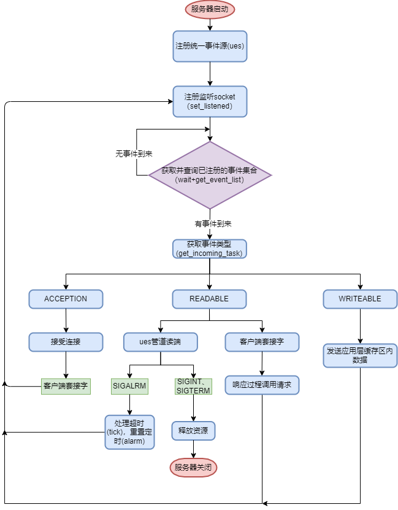
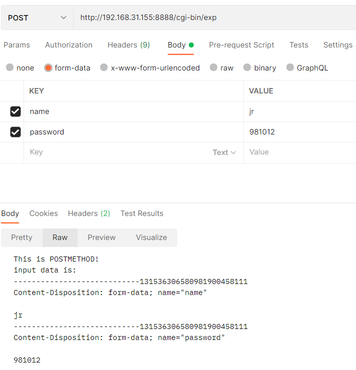
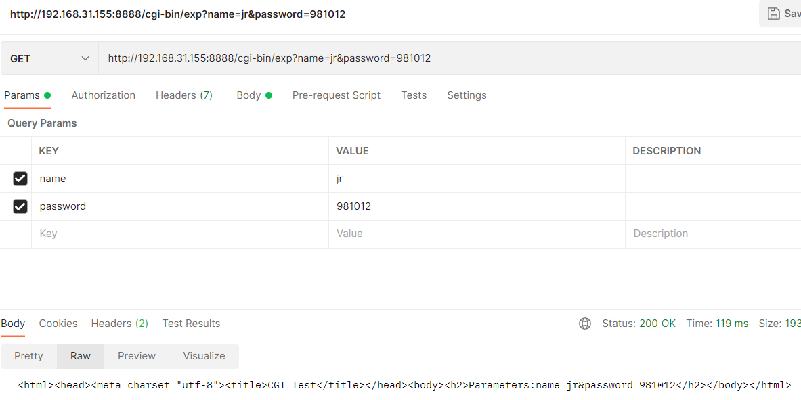
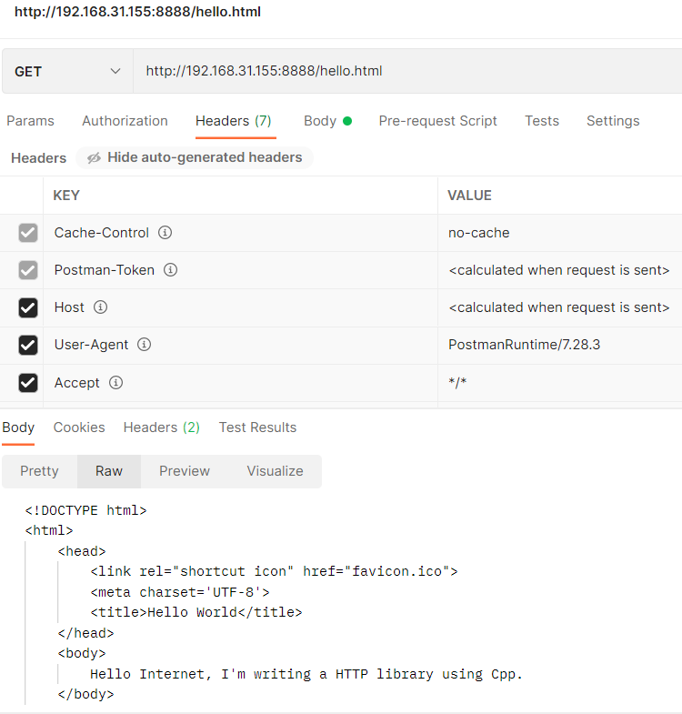

# jrNetWork   
## 1 概述
Linux平台上基于主线程Reactor+线程池模式的事件驱动网络库。  
该网络库具有如下特点：  
1. 封装了socket底层系统调用；   
2. 封装了IO多路复用相关系统调用，抽象出了一套接口，以兼容STL迭代器的形式提供就绪事件遍历；   
3. 允许对系统信号进行自定义处理，已将系统信号集成到Event中；
4. 可进行定时任务，带有简单日志系统；  
5. 自带HTTP-RPC客户端/服务端（采用状态机解析HTTP协议）实现； 
6. HTTP-RPC服务端也提供普通HTTP服务器功能：静态资源访问，CGI程序运行。
## 2 总体架构
### 2.1 jrNetWork网络库
#### 2.1.1 概览  
1. UML类图  

2. 服务端事件处理模式——基于IO复用的单Reactor多线程模式

3. 网络库整体流程（已统一封装poll/epoll）

#### 2.1.2 同步非阻塞IO与应用层缓存区(jrNetWork::Buffer)
1. 非阻塞IO读  
一次性读取所有内容到应用层缓存区，直到出现EAGAIN/EWOUDBACK错误；返回给用户的数据按用户所需大小从应用层缓存区中返回。  
2. 非阻塞IO写  
一直写入，直到出现EAGAIN/EWOUDBACK错误；若已写入的数据长度小于应写入的数据长度（即未完全写入），则将剩余数据存入应用层缓存区，并注册POLLOUT/EPOLLOUT事件（已统一封装为WRITE_OUT事件），等待在IO复用主循环中触发上述事件后，再将应用层缓存区数据全部写出。  
3. 应用层缓存区(jrNetWork::Buffer)  
内部采用std::string实现。    
#### 2.1.3 服务端定时器系统
· 超时与否的标准  
定时器采用绝对时间；若系统当前时间超过某定时器内部设定的绝对时间，则认为该定时器超时。  
· 定时器容器  
所有定时器均存储在一个定时器容器中；此处采用的数据结构是红黑树，由std::set实现。  
· 超时机制  
1. 采用alarm设定一个周期（参数timeout_period_sec，单位为秒），该周期即为心跳周期（心跳函数tick的执行周期）；    
2. tick函数的任务是查看定时器容器中有没有已超时的定时器；若有就进行其对应的超时处理并删除该定时器。
#### 2.1.4 线程池
线程池 = 任务队列 + 线程存储容器。  
· 工作机制
1. 线程池在对象创建时初始化一个存储一定数量工作线程的容器（采用std::vector），每个工作线程绑定private方法_run；    
2. 在方法_run中，采用条件变量查询任务队列是否为空；若不为空，则当前线程从任务队列中取出一个任务进行执行；若为空则阻塞当前线程直至任务队列中有待派发的任务；    
3. 用户通过public方法add_task将任务添加进任务队列；每添加一个任务，就通过条件变量通知某个线程。    
#### · 任务队列
任务队列即缓存区，由std::queue实现。其内部存储待执行的某一任务。  
· 线程
1. 每个线程内均绑定了一个_run函数，其内部从工作队列取出任务来执行；  
2. 工作队列与线程间的状态通信由条件变量实现(此处条件变量及互斥锁均采用C++11标准中的内容，而非Linux提供的系统调用)。
#### 2.1.5 简单日志系统
1. 通过宏函数进行打印，分为FATAL,WARNING, NOTICE三个严重等级；        
2. 日志元信息：\[等级]\[发生时间]\[进程id]\[线程id]: 自定义信息, at file 源文件名, 行数, function 函数名  
### 2.2 HTTP服务端
#### 2.2.1 HTTP协议解析状态机
1. HTTP请求行解析状态机

2. HTTP请求头部状态机

#### 2.2.2 CGI程序
#### · 参数获取
1. GET请求在url链接里自带CGI程序参数；参数与CGI程序名用?分割，参数之间用&分割。  
2. POST请求的body里默认为CGI程序参数。  
#### · 程序执行
1. 在fork出一个子进程来执行CGI程序之前，先建立两个匿名管道，一个重定向至stdin，一个重定向至stdout。   
2. GET请求的CGI程序参数输入通过环境变量QUERY_STRING传递，结果输出至标准输出；由于已经重定向到匿名管道，因此父进程读取匿名管道即可。   
3. POST请求的CGI程序参数输入通过设置环境变量CONTENT_LENGTH来确定参数长度，再将参数写至已重定向到stdin的匿名管道的写端；结果输出同上。
### 2.3 RPC客户端/服务端
#### 2.3.1 RPC模型  

在jrRPC中，RPC Runtime为TCP传输，由基于IO复用的Reactor模式实现，即网络库。   
#### 2.3.2 序列化与反序列化
采用json格式进行序列化与反序列化，具体使用第三方库[nlohmann::json](https://github.com/nlohmann/json)。  
1. Client->Server的JSON数据格式
```json
{
    "name":远程过程名字,
    "parameters":远程过程参数 
}
```
2. Server->Client的JSON数据格式
```json
{
    "return_val":返回值,
    "error":错误标志,
    "error_msg":错误信息
}
```
#### 2.3.3 服务端注册过程与调用过程
#### · 过程存储容器  
将过程以std::function<json(const json&)>对象的形式为value，以过程名的字符串为key，存入哈希map中。    
#### · 过程注册  
public方法register_procedure进行过程注册，具体如下：  
```c++
template<typename Ret, typename ... Args>
void _addNonMemberFunc(const std::string& name, Ret(*f)(Args...))
{
    this->_procList[name] = this->_addNonMemberFuncHelper(f, std::index_sequence_for<Args...>{});
}
```
在其内部，调用private方法_addNonMemberFuncHelper，将原始的std::function对象转换为std::function<json(const json&)>，即将原可调用对象转换为参数列表是json串，返回值也是json串的新可调用对象，并存入过程存储容器内；此举有两个目的：    
1. 方便过程的存储：原本参数列表、返回值类型都可能不同的可调用对象，现在转换为统一的可调用对象，方便存入容器内；   
2. 规避反射机制，方便过程的调用：server从client接收到json串后，可以直接将json字符串传入目标可调用对象，得到的json串返回值也可以直接发往client；无需如java的RPC服务器一样根据解析的json串获取参数名与值，再由运行期反射创建各个参数对象并赋值后再去进行函数调用。    
#### private方法register_procedure_helper负责将原可调用对象转换为参数列表是json串，返回值也是json串的新可调用对象，具体如下：       
```c++
template<typename Ret, typename... Args, std::size_t... N>
ProcType _addNonMemberFuncHelper(Ret(*f)(Args...), std::index_sequence<N...>)
{
    return [f](const nlohmann::json& parameters)->nlohmann::json
    {
        return f(parameters[N].get<typename std::decay<Args>::type>()...);
    };
}
```
在其内部，使用c++14的新特性std::index_sequence将原可调用对象的可变参数包进行包展开；以std::function<json(const json&)>对象包装原可调用对象：以std::decay推断第N个json对象的类型并转调原可调用对象，返回值隐式转换为json串。  
#### 2.3.4 客户端提供的调用方式
#### · 同步调用
同步阻塞在call方法中，直到获取远程调用结果。
#### · 异步调用
异步调用方法返回std::future，内部采用std::async实现。

## 3 测试结果
### 3.1 HTTP服务端非RPC功能测试
#### 3.1.1 收发测试
采用谷歌浏览器postman插件发送请求。
1. 响应POST请求（执行CGI示例程序）

2. 响应GET请求（执行CGI示例程序）

3. 响应GET请求（返回静态html网页）

### 3.2 RPC服务端压力测试（使用Jmeter进行测试）
TODO
